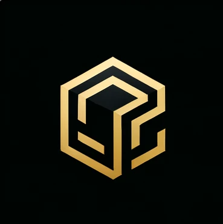

# Engineering Design VI
## CPE 322 A
**Repository for the CPE 322 A course in 2024**

To clone this repository on your own machine:

```git clone https://github.com/nicomcd/Engineering-Design-VI.git```

> *Develop a passion for learning. If you do, you will never cease to grow.*
> Anthony J. D'Angelo


### Lab Assignments
1. GHDL and GTKWave [x]
2. Command Line [x]
3. Python []
4. Django and Flask []
5. Paho-MQTT []
6. Node.js and Pystache []
7. ThingSpeak and Google Sheets []
8. Data Analysis []
9. YANG []
10. Blockchain []

---



### cHAMber.co Members
- [Follow Anthony on GitHub](https://github.com/BonkMasterMord)
- [Follow Seongjun on GitHub](https://github.com/successjun)
- [Follow me on GitHub](https://github.com/nicomcd)


